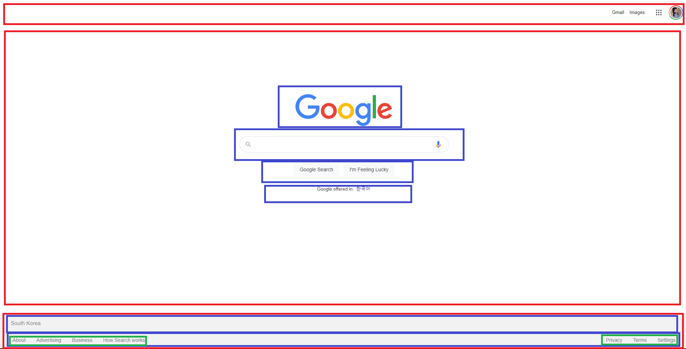
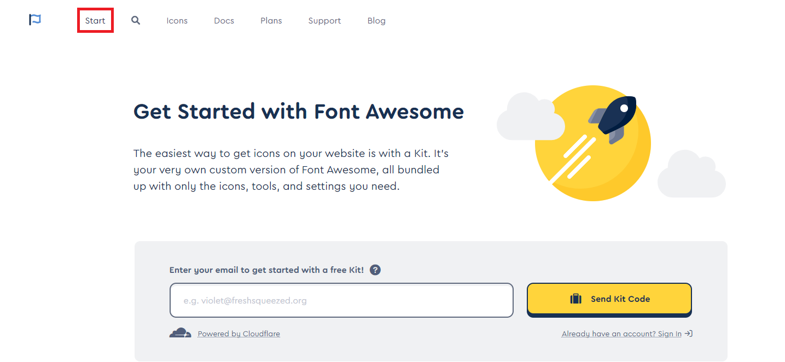
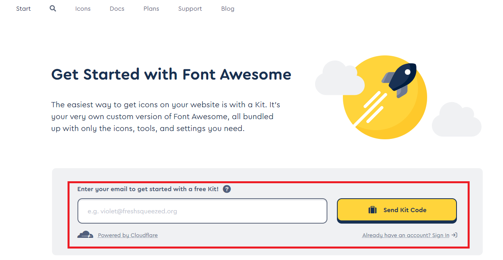
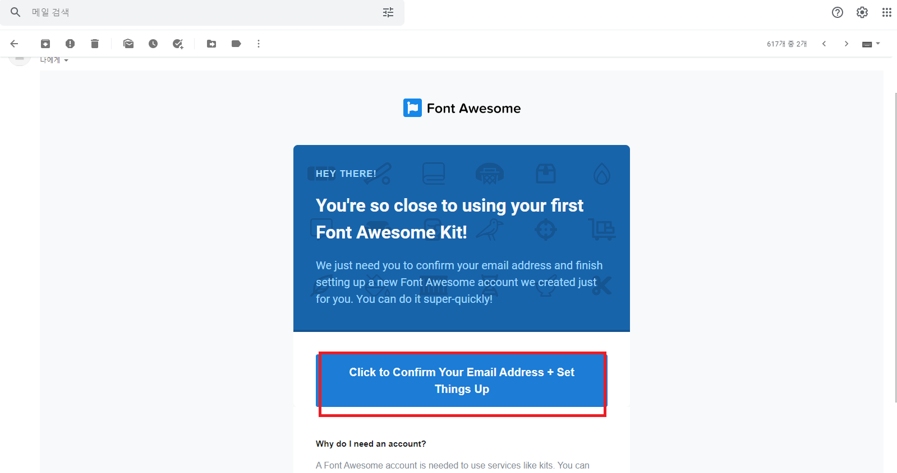
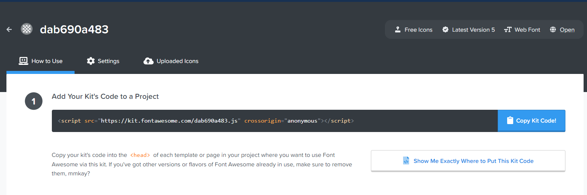
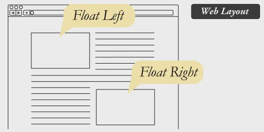

## 📌 사용기술

- HTML
- CSS

## 📌 데모 링크

<a href="https://tranquil-sfogliatella-e9d6b5.netlify.app/" target="_blank">구글 웹 사이트 만들기</a>

## 📌 강의내용 정리

### 🌍 구글 웹사이트 만들기

1) 웹사이트를 처음에 어떻게 분석하기

  * 웹 사이트에 구조를 보고 박스로 나누어 봐라(머리, 몸통, 다리)

    - 강사님은 3등분으로 나눕시다.

      - 머리, 몸통, 다리
  
      

  * HTML과 CSS파일이 잘 연결이 되는지 확인

    * `<head>`태그 안에 `<link>`태그가 있는지, `<link>`태그속 href에 css파일 주소가 잘 연결됬는지! 스펠체크!

  * 크롬의 개발도구를 활용하자

    - 웹사이트에서 마우스 오른쪽 클릭 
    - 맨마지막에 있는 inspect 또는 검사 클릭

2) 이세상 모든 아이콘이 있는 웹사이트!
   
   👉🏻[fontawsome](https://fontawesome.com/)

   **CDN 링크 신청방법**
   
   * 홈페이지에서 start 메뉴 누르기

    

   * 이메일 주소 입력하기 
  
    

   * 메일 인증하고 링크 받기 

    

    

### CDN (Content Delivery Network)이란?😏

CDN(콘텐츠 전송 네트워크)은 지리적으로 분산된 여러 개의 서버입니다. **웹 콘텐츠를 사용자와 가까운 곳에서 전송함**으로써 전송 속도를 높입니다. 전 세계 데이터센터는 파일 복사본을 임시로 저장하는 프로세스인 캐싱을 사용합니다. 따라서 사용자는 가까운 서버를 통해 웹 활성화 디바이스 또는 브라우저에서 인터넷 콘텐츠에 빠르게 접속할 수 있습니다. **CDN은 웹 페이지, 이미지, 비디오 등의 콘텐츠**를 사용자의 물리적 위치와 가까운 프록시 서버에 캐싱합니다. 이렇게 하면 콘텐츠가 로딩될 때까지 기다릴 필요 없이 영화 감상, 소프트웨어 다운로드, 은행 잔고 확인, 소셜 미디어 포스팅, 구매 등의 작업을 할 수 있습니다.

**CDN을 마치 ATM처럼 생각해도 좋습니다.** 여러 곳에 ATM을 설치해 놓으면 사용자가 빠르고 효율적으로 현금을 찾을 수 있습니다. 은행에서 긴 줄을 서서 기다릴 필요 없이 가까운 곳에 있는 ATM을 바로 사용하면 됩니다.

저희는 CDN을 통해서 fontawsome이 만들어준 스타일을 가져온겁니다!  

🎗`<span>태그` 

어떠한 특징이 없는 명목상에 태그! 주로 명목상 그룹을 나눌때 씁니다! 

3) 새로 사용된 스타일✨

   - **float** : 이미지 또는 html 태그 요소를 배치하는데 쓰임 float을 쓰게되면 해당 영역의 사이즈가 float을 포함하고있는 컨텐츠 영역만큼 줄어듬 (다음 강의 보시면 이 설명이 이해가 되실거에요)
  
      

     
  
    - **text-decoration** : 밑줄치기, 가운데로 긋기등 텍스트에 여러 효과를 줄 수 있다. 저는 주로 `<a>태그`의 거슬리는 스타일중 하나인 밑줄을 제거하는데 많이 씁니다.

    ### border 스타일의 유용한 쓰임🖍

    `<div>`태그로 영역들은 나누어 놨지만 사실 이 영역이 얼마나 큰건지, 어디에 위치하는지는 잘 보이지 않습니다. 따라서 웹개발을 하는데 있어서 가끔 스타일을 줘도 내가 예상한것대로 움직이 않는 경우가 많은데요. 이럴때 쓰기 좋은게 border 입니다. border을 통해 div 또는 다른태그들에 테두리를 그림으로써 해당 태그가 얼마나 많은 영역을 차지하고 있는지 확인하기 좋습니다. 일종에 설계도 느낌으로 많이 씁니다. 

    ### :hover🧨

    CSS 스타일로 어떤 이벤트가 발생했을때의 스타일도 줄 수 있습니다. 그중에 많이쓰이는 것은 `hover` 인데요. 마우스가 태그위로 올라왔을때 발생하는 이벤트 입니다. 그 외에도 `:active`, `:focus` 등이 있음(한번 찾아보세요!)

    ### 가상클래스 정리 
    - `:link` : 방문 전

    - `:visited` : 방문 후

    - `:focus` : 커서 초점 (마우스 클릭 중)

    - `:hover` : 마우스 올라가 있는 상태
    
    - `:active` : 활성화 순간

  
    ### HTML태그에 직접 스타일을 주기✨
    태그를 css에서 직접 언급을 하여 스타일을 줄 수 있습니다 

    ```css
    div {

      color:red;

    }
    ```

    이렇게하면 스타일을 구지 일일히 만들고 적용하지 않아도 모든 div 태그에 자동으로 color:red 가 적용이됩니다

    내가 어떤태그에 공통적인스타일을줘야한다 할때 쓰면 유용한 방식입니다.

    ### padding or margin🎈

    padding 또는 margin은 1개 2개 그리고 3개의 값을 가질 수 있음

    `padding: 20px`   => top, left, bottom, right 모든 방향에 20px의 공간을줌

    `padding: 20px 10px` => 세로방향 (top, bottom)에는 20px의 공간을 가로방향 (left, right)에는 10px 만큼의 공간적용

    `padding: 10px 20px 30px 40px` => 첫번째부터 top, left, bottom, right 순서로 공간을적용함
    
    👉🏻[링크참조](https://www.w3schools.com/css/css_margin.asp)

    ### CSS 정리🏋️‍♂️

    - `display` : 요소가 어떻게 보여질지를 결정
    - `border: 1px solid red;` - 테두리를 그려준다 (두께, 스타일, 색깔)
    - `border-radius` : 모서리를 둥게함 
    - `width` : 넓이 지정
    - `height` : 높이 지정
    - `position` : html태그를 위치시키는 방식 지정 (다음 챕터에서 다룰 예정^^)
    - `background-color` : 배경색
    - `font-family` : 폰트 스타일
    - `box-shadow` : 박스뒤에 그림자 
    - `color` : 글씨색 (16진수, rgb, 색깔이름 이렇게 세가지로 표현 가능)
  
    ➡ 맘에드는 스타일 발견 -> selector로 선택 -> 스타일확인 -> 내 코드에서 스타일만들어서 적용 -> html에 적용 -> 확인


